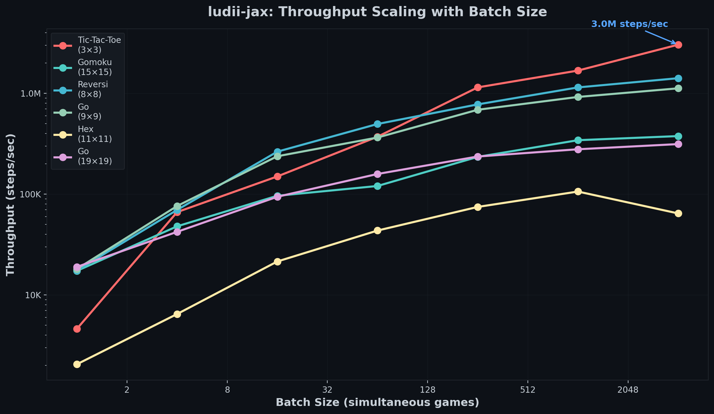
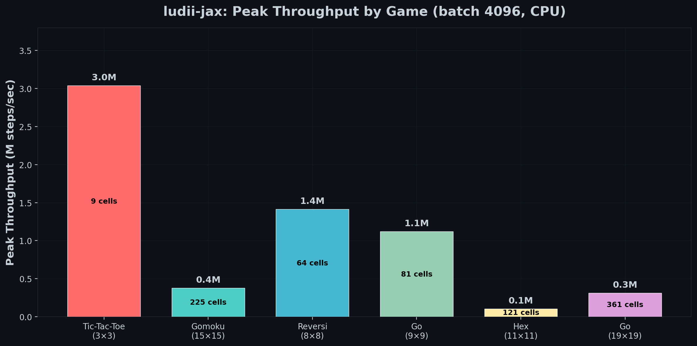
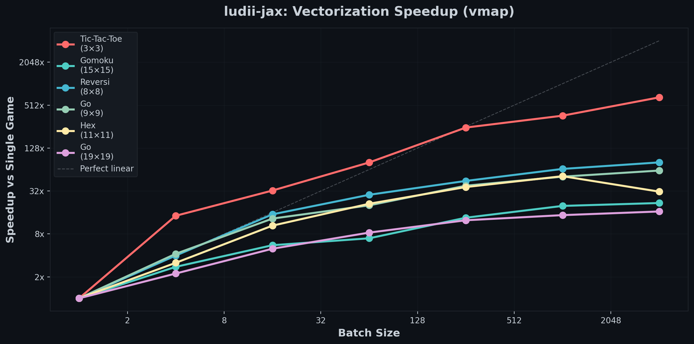

# ludii-jax

Compile [Ludii](https://ludii.games/) board game descriptions directly to JAX-accelerated environments. Pass any `.lud` file and get a GPU-ready environment running at hundreds of thousands of steps per second.

```python
from ludii_jax import compile
import jax

env = compile("games/tic_tac_toe.lud")
state = env.init(jax.random.PRNGKey(0))
state = env.step(state, action)
```

**96% of all 1,212 Ludii games** compile and produce legal moves. **88 games** validated move-for-move against Ludii reference traces with zero divergence.

## Performance

<p align="center">
  
</p>

**3 million steps/sec** for Tic-Tac-Toe. **1.1 million** for Go 9x9. On a single CPU -- fully compatible with Apple Metal GPU and NVIDIA CUDA.

<p align="center">
  
</p>

The key: `jax.vmap` runs thousands of games as a single vectorized kernel. No Python loop, no per-game overhead.

<p align="center">
  
</p>

| Game | Board | Single | Batch 4096 | Speedup |
|------|-------|--------|-----------|---------|
| Tic-Tac-Toe | 3x3 | 5K | **3.0M** | 600x |
| Reversi | 8x8 | 18K | **1.4M** | 78x |
| Go | 9x9 | 18K | **1.1M** | 61x |
| Gomoku | 15x15 | 17K | **377K** | 22x |
| Go | 19x19 | 19K | **314K** | 17x |
| Hex | 11x11 | 12K | **64K** | 5x |

*Apple M4 CPU. Compile once in ~150ms, then pure XLA execution. Also runs on Apple Metal GPU and NVIDIA CUDA. Hex is lower due to flood-fill BFS in the connection end condition.*

## How It Works

```
.lud file
  -> Parser (permissive Lark grammar, 100% of Ludii)
  -> Semantic analysis (board topology, pieces, rules, phases)
  -> Graph construction (every board is an adjacency matrix)
  -> JAX compilation (ludeme -> pure JAX functions)
  -> Environment (init / step / legal_actions / terminal / rewards)
```

Every board -- square, hex, triangle, concentric rings, Morris boards, arbitrary graphs -- reduces to the same `BoardTopology`: a set of sites with an adjacency matrix. Lines, slides, hops, and connections all derive from walking the adjacency graph.

Every action is a `(source, destination)` pair. Step, slide, hop, and leap only differ in which destinations are reachable. One action model, one code path.

## Installation

```bash
pip install jax jaxlib lark numpy
git clone https://github.com/claycantrell/ludii-jax.git
cd ludii-jax
pip install -e .
```

Requires Python 3.9+ and [JAX](https://docs.jax.dev/en/latest/installation.html).

## Usage

### Compile and Play

```python
from ludii_jax import compile
import jax
import jax.numpy as jnp

# Any Ludii .lud game
env = compile("""
(game "Hex"
    (players 2)
    (equipment {
        (board (hex Diamond 11))
        (piece "Marker" Each)
        (regions P1 {(sites Side NE) (sites Side SW)})
        (regions P2 {(sites Side NW) (sites Side SE)})
    })
    (rules
        (play (move Add (to (sites Empty))))
        (end (if (is Connected Mover) (result Mover Win)))
    ))
""")

state = env.init(jax.random.PRNGKey(0))
print(f"Board: {env.num_sites} sites, {env.num_actions} actions")
print(f"Legal moves: {state.legal_action_mask.sum()}")
```

### Batch Simulation

```python
init = jax.jit(jax.vmap(env.init))
step = jax.jit(jax.vmap(env.step))

keys = jax.random.split(jax.random.PRNGKey(0), 1024)
states = init(keys)
# 1024 games in parallel on GPU
```

### From File

```python
env = compile("path/to/game.lud")
```

## Validated Games

88 games validated move-for-move against Ludii reference traces (up to 50 moves each, zero divergence):

**Placement / Line:** Tic-Tac-Toe, Gomoku, Pente, Connect6, Yavalath, Squava, Notakto, Tic-Tac-Toe Misere, Tapatan, Picaria, Nine Holes, Three Men's Morris, Alquerque de Tres, Driesticken, Dris at-Talata, San-Noku-Narabe, Selbia, Ngre E E, Ngrin, Engijn Zirge, Djara-Badakh, Akidada, Roll-Ing to Four, Fanorona Telo, Wure Dune, Yavalax, Adidada

**Connection:** Hex, Y, Havannah, Cross, Crossway, Gonnect, Unlur, Master Y, Chameleon, Diagonal Hex, Esa Hex, Gyre, Pippinzip, Scaffold

**Territory:** Reversi, Go, Weiqi, Atari Go, BlooGo, One-Eyed Go, Rolit, Cavity, Flower Shop, Redstone, Patok, Mity, Dorvolz, HexTrike, MacBeth, Atoll

**Movement:** English Draughts (with promotion + chain capture), Wolf and Sheep, Breakthrough, Clobber, Jeson Mor, Bamboo

**Custodial / Tafl:** Hasami Shogi, Dai Hasami Shogi, Tablut, Hnefatafl, Tawlbwrdd, ArdRi, Alea Evangelii, Poprad Game

**Mancala:** Oware, Kalah, Wari, Uril, Das Bohnenspiel, English Wari, Aw-li On-nam Ot-tjin, Enindji, Erherhe, Fondji, Kpo, Shono

**Other:** Ecosys, Fang, Tibetan Jiuqi

## What's Supported

### Board Types
- Square grids (N x N, 8 directions)
- Rectangular grids (W x H)
- Hexagonal boards (regular, diamond, triangle, variable-width, rectangle)
- Triangular grids
- Concentric ring boards (Nine Men's Morris) with Ludii-matching vertex numbering
- Explicit graph boards (vertex + edge lists)
- Star, complete, spiral graphs
- Composite boards (merge, shift, add, remove with cell indices, rotate, scale)

### Movement
- **Step**: move 1-N cells in a direction (per-player forward restriction)
- **Hop**: jump over a piece (opponent, friendly, or any occupied; with chain capture)
- **Slide**: move any distance until blocked (direction restriction + cell blocking)
- **Leap**: non-adjacent jumps (knight, camel, custom offsets)
- **Place**: put a piece on an empty site
- **Sow**: mancala seed distribution with per-player tracks, store skipping, and capture

### Effects
- Custodial capture (from last-moved-to cell, orthogonal/all directions, hostile cells)
- Surround capture at corners (orthogonal neighbor check)
- Piece promotion (Counter -> DoubleCounter at opposite row)
- Chain capture (moveAgain with forced continuation from landing cell)
- Forced capture priority (hops take precedence over steps)
- Mill detection and removal (line-of-3 triggers opponent piece removal)
- Score tracking

### End Conditions
- Line of N (with region exclusion for starting rows, collinear geometry filter)
- Connection (flood-fill BFS between board sides, hex side detection)
- No legal moves
- Piece count threshold
- Full board (draw or by score)

### Game Features
- N-player support (parameterized, not hardcoded)
- Multi-phase games (placement -> movement with automatic phase transition)
- Per-player direction masks (forward diagonal for P1, backward diagonal for P2)
- Per-piece direction, blocking, and movement compilation
- Dice / stochastic elements
- Mancala sowing with Kalah capture rules and extra-turn-on-store
- Recursive site set evaluation (difference, union, intersection, expand)
- Named player regions extracted from equipment definitions

## Current Limitations

The following game mechanics are not yet implemented. Games using these features will compile and produce legal moves, but may not match Ludii's behavior exactly:

### Not Yet Supported
- **Stacking / gravity placement** -- games like Connect Four where pieces drop to the lowest position in a column. Board is modeled flat, not as stacked columns.
- **Maximum capture chain enforcement** -- draughts variants (Brazilian, International) that require choosing the longest available capture sequence. All captures are legal, not just the longest.
- **Directional capture (approach/withdrawal)** -- Fanorona-style captures where the direction of movement determines which enemy pieces are taken.
- **Vertex-based graph boards (`use:Vertex`)** -- games like Fox and Geese that play on intersections of a graph rather than cells. Composite boards using vertex mode produce incorrect topology.
- **Complex composite board operations** -- deeply nested board transformations (splitCrossings, dual, keep, intersect) that go beyond simple merge/shift/remove. Games like ConHex and Fractal have boards we cannot reconstruct.
- **Intervene / pattern constraints** -- Agon-style rules that restrict moves based on piece arrangement patterns.
- **Multi-phase removal openings** -- games like Konane where the opening phase involves removing pieces before the movement phase begins.
- **Hand selection mechanics** -- Quarto-style games where one player selects a piece for the opponent to place.
- **Hidden information** -- games with fog of war, hidden pieces, or private hands are not supported.
- **3+ player games with coalitions** -- while N-player alternation works, coalition logic and complex turn orders are not modeled.

### Partial Support
- **Mill removal (Nine Men's Morris)** -- mill detection and removal sub-phase works for the first mill in a game but has edge cases with repeated mills and placement-phase mills. NMM validates 23/50 moves.
- **Tafl king capture** -- the king surround mechanic (captured when surrounded on all 4 sides) uses the throne-as-hostile heuristic which works for standard Tablut but may not cover all Tafl variants.
- **Connection detection on large boards** -- the flood-fill BFS causes JIT compilation hangs on boards with 150+ cells. Boards under ~120 cells work correctly.

## Architecture

```
ludii_jax/
  parser/
    ludii_grammar.lark    # Permissive grammar (100% parse rate)
    parse.py              # .lud text -> parse tree

  analysis/
    topology.py           # Board spec -> BoardTopology (adjacency graph)
    game_info.py          # Parse tree -> GameInfo (pieces, mechanics, phases)
    sites.py              # Recursive site set evaluator

  compiler/
    moves.py              # Step/Hop/Slide/Leap/Place/Sow -> JAX functions
    effects.py            # Custodial/Surround/Score -> JAX functions
    conditions.py         # Line/Connected/NoMoves -> JAX functions
    compose.py            # Assemble into init/step/legal/terminal

  runtime/
    state.py              # Dynamic GameState namedtuple + JAX pytree
    environment.py        # Env API: init/step
    lookup.py             # Precomputed adjacency/slide/line tables

  compile.py              # Top-level: .lud -> Environment
```

All game logic compiles to pure JAX functions at init time. Zero Python overhead during gameplay. Compatible with `jax.jit`, `jax.vmap`, `jax.lax.scan`.

## Validation

Reference traces generated from Ludii's Java engine are stored in `tests/traces/`. The validation suite replays each trace through ludii-jax and compares legal moves and termination at every step.

```bash
# Validate against Ludii reference traces (88/97 pass)
python tests/test_against_ludii.py

# Run compilation coverage on full corpus
python tests/test_coverage.py /path/to/ludii/games 200
```

## Acknowledgments

- [Ludii](https://ludii.games/) -- the game description language and corpus
- [JAX](https://github.com/jax-ml/jax) -- hardware-accelerated numerical computing
- [Lark](https://github.com/lark-parser/lark) -- parsing toolkit
- [PGX](https://github.com/sotetsuk/pgx) -- JAX game environments (inspiration for the API)

## License

MIT
